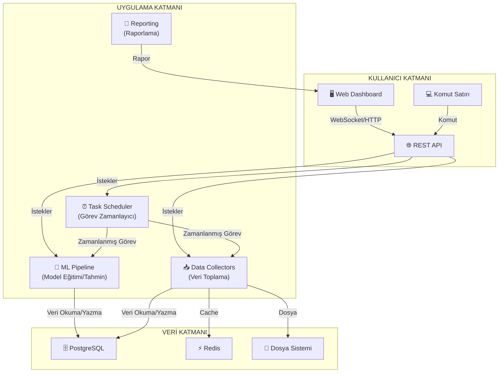

# 🤖 AI Automation Bot - Enterprise Edition

[](https://www.python.org/downloads/)
[](LICENSE)
[](https://www.docker.com/)
[](.github/workflows)
[](SECURITY.md)
[](CONTRIBUTING.md)

---

<div align="center">

> **🚀 Kurumsal seviyede, modüler, ölçeklenebilir ve sürdürülebilir Python tabanlı AI Otomasyon Botu**
> 
> **Mikroservis mimarisi, yüksek performans, güvenlik ve esnek entegrasyon olanakları ile kurumsal ihtiyaçlara tam uyum sağlar. Gelişmiş izleme, otomasyon, veri işleme ve makine öğrenmesi pipeline'ları ile uçtan uca otomasyon sağlar.**

[📖 Dokümantasyon](docs/) • [🐛 Issue Bildir](https://github.com/codeewithmert/AIOtomasyonBotu/issues) • [💬 Tartışma](https://github.com/codeewithmert/AIOtomasyonBotu/discussions) • [🔒 Güvenlik](SECURITY.md)

</div>

---

## 📋 İçindekiler
- [🚀 Özellikler](#-özellikler)
- [🏗️ Mimari](#️-mimari)
- [📦 Kurulum](#-kurulum)
- [🔧 Kullanım](#-kullanım)
- [📊 API Dokümantasyonu](#-api-dokümantasyonu)
- [🧪 Test](#-test)
- [🐳 Docker](#-docker)
- [📈 Monitoring](#-monitoring)
- [🤝 Katkıda Bulunma](#-katkıda-bulunma)
- [📄 Lisans](#-lisans)

---

## 🚀 Özellikler

### 🤖 AI & Machine Learning
- **Çoklu Model Desteği**: Random Forest, XGBoost, LightGBM, TensorFlow, PyTorch
- **Otomatik Model Seçimi**: Hiperparametre optimizasyonu ile en iyi model seçimi
- **Model Değerlendirme**: Kapsamlı metrikler ve cross-validation
- **Model Versiyonlama**: MLflow ile model yaşam döngüsü yönetimi
- **Real-time Tahmin**: API üzerinden anlık tahmin servisleri

### 📊 Veri İşleme & Analiz
- **Çoklu Veri Kaynağı**: API, Web Scraping, Database, File Systems
- **Otomatik Veri Temizleme**: Eksik veri, outlier, normalizasyon işlemleri
- **Feature Engineering**: Otomatik özellik seçimi ve mühendisliği
- **Veri Görselleştirme**: Matplotlib, Seaborn, Plotly, Bokeh
- **Real-time Stream Processing**: Asenkron veri işleme

### 🔄 Otomasyon & Scheduling
- **Akıllı Task Scheduler**: Cron tabanlı görev planlama
- **Retry Mekanizması**: Hata durumunda otomatik yeniden deneme
- **Dependency Management**: Görev bağımlılıkları ve sıralama
- **Background Processing**: Celery ile asenkron görev işleme
- **Event-driven Architecture**: Event-based otomasyon tetikleyicileri

### 🌐 Web API & Dashboard
- **RESTful API**: FastAPI ile modern API tasarımı
- **Real-time Dashboard**: Streamlit, Dash, Gradio entegrasyonu
- **WebSocket Support**: Real-time iletişim
- **API Documentation**: Otomatik Swagger/OpenAPI dokümantasyonu
- **Rate Limiting**: API kullanım sınırlandırması

### 🔒 Güvenlik & Monitoring
- **Authentication & Authorization**: JWT tabanlı kimlik doğrulama
- **Encryption**: Veri şifreleme ve güvenli depolama
- **Audit Logging**: Kapsamlı işlem kayıtları
- **Health Monitoring**: Sistem sağlığı izleme
- **Performance Metrics**: CPU, Memory, Disk kullanımı

### 📈 Raporlama & Notifications
- **Otomatik Raporlama**: PDF, Excel, HTML formatlarında
- **Email Notifications**: SMTP ile email bildirimleri
- **Slack Integration**: Slack webhook entegrasyonu
- **Custom Templates**: Jinja2 ile özelleştirilebilir şablonlar
- **Scheduled Reports**: Zamanlanmış rapor gönderimi

---

## 🏗️ Mimari

### 📁 Proje Yapısı

```
AIOtomasyonBotu/
├── 📁 src/                    # Ana kaynak kodları
│   ├── 📁 api/               # REST API katmanı
│   │   ├── 📁 middleware/    # API middleware'leri
│   │   └── 📁 routes/        # API endpoint'leri
│   ├── 📁 automation/        # Otomasyon motoru
│   ├── 📁 core/              # Çekirdek bileşenler
│   ├── 📁 data/              # Veri işleme katmanı
│   │   ├── 📁 collectors/    # Veri toplayıcıları
│   │   ├── 📁 processors/    # Veri işleyicileri
│   │   └── 📁 storage/       # Veri depolama
│   ├── 📁 ml/                # Machine Learning
│   │   ├── 📁 models/        # ML modelleri
│   │   ├── 📁 pipeline/      # ML pipeline'ları
│   │   └── 📁 evaluation/    # Model değerlendirme
│   ├── 📁 reporting/         # Raporlama sistemi
│   └── 📁 web/               # Web arayüzü
├── 📁 config/                # Konfigürasyon dosyaları
├── 📁 tests/                 # Test dosyaları
├── 📁 docs/                  # Dokümantasyon
├── 📁 docker/                # Docker dosyaları
└── 📁 scripts/               # Yardımcı scriptler
```

### 🔄 Sistem Mimarisi



---

## 📦 Kurulum

### 🐍 Python Gereksinimleri

- Python 3.8 veya üzeri
- pip (Python package manager)
- virtualenv (önerilen)

### 🔧 Hızlı Kurulum

```bash
# Repository'yi klonlayın
git clone https://github.com/your-username/koordinatci.git
cd koordinatci

# Virtual environment oluşturun
python -m venv venv
source venv/bin/activate  # Linux/Mac
# veya
venv\Scripts\activate     # Windows

# Bağımlılıkları yükleyin
pip install -r requirements.txt

# Konfigürasyon dosyasını kopyalayın
cp config/config.example.yaml config/config.yaml

# Veritabanını başlatın
python -m src.main --init-db

# Uygulamayı başlatın
python -m src.main
```

### 🐳 Docker ile Kurulum

```bash
# Docker Compose ile tam ortam
docker-compose up -d

# Sadece temel servisler
docker-compose --profile basic up -d

# Monitoring ile birlikte
docker-compose --profile monitoring up -d

# Production ortamı
docker-compose --profile production up -d
```

### 🔐 Environment Variables

```bash
# .env dosyası oluşturun
cp env.example .env

# Gerekli environment variable'ları ayarlayın
DB_PASSWORD=your_secure_password
API_KEY=your_api_key
ENCRYPTION_KEY=your_encryption_key
JWT_SECRET=your_jwt_secret
REDIS_PASSWORD=your_redis_password
```

---

## 🔧 Kullanım

### 🚀 Temel Kullanım

```python
from src.main import AIAutomationBot

# Bot'u başlat
bot = AIAutomationBot()

# Bot'u çalıştır
bot.start()

# Belirli bir görevi çalıştır
bot.run_task("data_collection")

# Bot'u durdur
bot.stop()
```

### 📊 API Kullanımı

```bash
# Health check
curl http://localhost:8000/api/status/health

# Veri toplama
curl -X POST http://localhost:8000/api/data/collect

# Model eğitimi
curl -X POST http://localhost:8000/api/ml/train

# Tahmin yapma
curl -X POST http://localhost:8000/api/ml/predict \
  -H "Content-Type: application/json" \
  -d '{"features": [1, 2, 3, 4]}'
```

### 🔄 Otomasyon Görevleri

```python
# Özel görev tanımlama
def custom_task():
    print("Özel görev çalışıyor...")

# Görevi scheduler'a ekle
bot.scheduler.add_task(
    name="custom_task",
    func=custom_task,
    schedule_expr="0 12 * * *",  # Her gün saat 12'de
    max_retries=3
)
```

### 📈 ML Pipeline Kullanımı

```python
# Veri yükleme
data = bot.ml_pipeline.load_data("path/to/data.csv")

# Model eğitimi
model = bot.ml_pipeline.train_model(
    data=data,
    target_column="target",
    model_type="random_forest"
)

# Tahmin
predictions = bot.ml_pipeline.predict(model, new_data)
```

---

## 📊 API Dokümantasyonu

### 🔗 Endpoint'ler

| Method | Endpoint | Açıklama |
|--------|----------|----------|
| GET | `/api/status/health` | Sistem sağlığı |
| GET | `/api/status/metrics` | Performans metrikleri |
| POST | `/api/data/collect` | Veri toplama |
| GET | `/api/data/sources` | Veri kaynakları |
| POST | `/api/ml/train` | Model eğitimi |
| POST | `/api/ml/predict` | Tahmin yapma |
| GET | `/api/ml/models` | Mevcut modeller |
| POST | `/api/automation/tasks` | Görev oluşturma |
| GET | `/api/automation/tasks` | Görev listesi |
| POST | `/api/reports/generate` | Rapor oluşturma |

### 📝 Örnek API Kullanımı

```python
import requests

# API base URL
BASE_URL = "http://localhost:8000/api"

# Health check
response = requests.get(f"{BASE_URL}/status/health")
print(response.json())

# Veri toplama
response = requests.post(f"{BASE_URL}/data/collect")
print(response.json())

# Model eğitimi
response = requests.post(f"{BASE_URL}/ml/train", json={
    "data_source": "path/to/data.csv",
    "target_column": "target",
    "model_type": "random_forest"
})
print(response.json())
```

---

## 🧪 Test

### 🧪 Test Çalıştırma

```bash
# Tüm testleri çalıştır
pytest

# Coverage ile test
pytest --cov=src

# Belirli test kategorisi
pytest tests/unit/
pytest tests/integration/
pytest tests/e2e/

# Performance testleri
pytest tests/performance/
```

### 📊 Test Kategorileri

- **Unit Tests**: Bireysel fonksiyon ve sınıf testleri
- **Integration Tests**: Bileşenler arası entegrasyon testleri
- **E2E Tests**: Uçtan uca sistem testleri
- **Performance Tests**: Performans ve yük testleri

## 🐳 Docker

### 🐳 Docker Image'ları

```bash
# Development image
docker build -t ai-bot:dev --target development .

# Production image
docker build -t ai-bot:prod --target production .

# Multi-stage build
docker build -t ai-bot:latest .
```

### 🐳 Docker Compose Servisleri

| Servis | Açıklama | Port |
|--------|----------|------|
| ai-bot | Ana uygulama | 8000, 8080 |
| postgres | PostgreSQL veritabanı | 5432 |
| redis | Redis cache | 6379 |
| mongodb | MongoDB (opsiyonel) | 27017 |
| elasticsearch | Elasticsearch (opsiyonel) | 9200 |
| kibana | Kibana dashboard (opsiyonel) | 5601 |
| prometheus | Prometheus monitoring (opsiyonel) | 9090 |
| grafana | Grafana dashboard (opsiyonel) | 3000 |

### 🐳 Docker Profiles

```bash
# Temel servisler
docker-compose --profile basic up -d

# Tam stack (tüm servisler)
docker-compose --profile full-stack up -d

# Monitoring ile
docker-compose --profile monitoring up -d

# Production ortamı
docker-compose --profile production up -d
```

## 📈 Monitoring

### 📊 Monitoring Araçları

- **Prometheus**: Metrik toplama
- **Grafana**: Dashboard ve görselleştirme
- **Elasticsearch**: Log analizi
- **Kibana**: Log görselleştirme
- **Health Checks**: Sistem sağlığı izleme

### 📈 Metrikler

- CPU, Memory, Disk kullanımı
- API response time
- Error rate
- Task execution metrics
- Model performance metrics

### 🔔 Alerting

```yaml
# Alert kuralları
alerts:
  cpu_threshold: 80%
  memory_threshold: 85%
  disk_threshold: 90%
  error_rate_threshold: 5%
```

---

## 🤝 Katkıda Bulunma

### 🔧 Geliştirme Ortamı

```bash
# Repository'yi fork edin
git clone https://github.com/your-username/koordinatci.git
cd koordinatci

# Development branch oluşturun
git checkout -b feature/your-feature-name

# Pre-commit hooks kurun
pre-commit install

# Kod formatını kontrol edin
black src/
isort src/
flake8 src/
mypy src/
```

### 📝 Katkı Süreci

1. Issue açın veya mevcut issue'yu inceleyin
2. Feature branch oluşturun
3. Kodunuzu yazın ve test edin
4. Pull request açın
5. Code review sürecini bekleyin

### 📋 Kod Standartları

- **Python**: PEP 8 standartları
- **Type Hints**: Tüm fonksiyonlarda type annotation
- **Docstrings**: Kapsamlı dokümantasyon
- **Tests**: %90+ test coverage
- **Linting**: Black, isort, flake8, mypy

## ❓ SSS (Sıkça Sorulan Sorular)

**Q: Hangi veri kaynaklarını destekliyor?**  
A: API, web scraping, veritabanı, dosya sistemleri ve daha fazlası.

**Q: Model eğitimi için GPU desteği var mı?**  
A: Evet, TensorFlow ve PyTorch ile GPU hızlandırma desteklenir.

**Q: Docker ile production ortamı hazır mı?**  
A: Evet, production-ready Docker Compose profilleri mevcuttur.

**Q: Hangi rapor formatları destekleniyor?**  
A: PDF, Excel, HTML ve özelleştirilebilir şablonlar.

**Q: Monitoring ve alert sistemi var mı?**  
A: Prometheus, Grafana ve alerting desteğiyle kapsamlı monitoring sağlar.

---

## 📚 Kaynaklar & İleri Okuma
- [FastAPI](https://fastapi.tiangolo.com/)
- [Scikit-learn](https://scikit-learn.org/)
- [Docker](https://www.docker.com/)
- [PostgreSQL](https://www.postgresql.org/)
- [Prometheus](https://prometheus.io/)
- [Grafana](https://grafana.com/)
- [MLflow](https://mlflow.org/)

## 📄 Lisans

Bu proje MIT lisansı ile lisanslanmıştır. Detaylar için [LICENSE](LICENSE) dosyasını inceleyin.

## 🙏 Teşekkürler

- [FastAPI](https://fastapi.tiangolo.com/) - Modern web framework
- [Scikit-learn](https://scikit-learn.org/) - Machine learning
- [Docker](https://www.docker.com/) - Containerization
- [PostgreSQL](https://www.postgresql.org/) - Database
- [Redis](https://redis.io/) - Cache & message broker

## 📞 İletişim

- **Email**: mertdmrrrs@hotmail.com
- **GitHub**: [@codeewithmert](https://github.com/codeewithmert)
- **LinkedIn**: [Mert Demir](https://www.linkedin.com/in/mert-demir-9a9612373/)

---

<div align="center">

**⭐ Bu projeyi beğendiyseniz yıldız vermeyi unutmayın! ⭐**

</div> 
